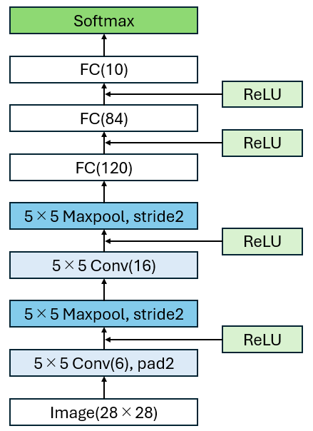
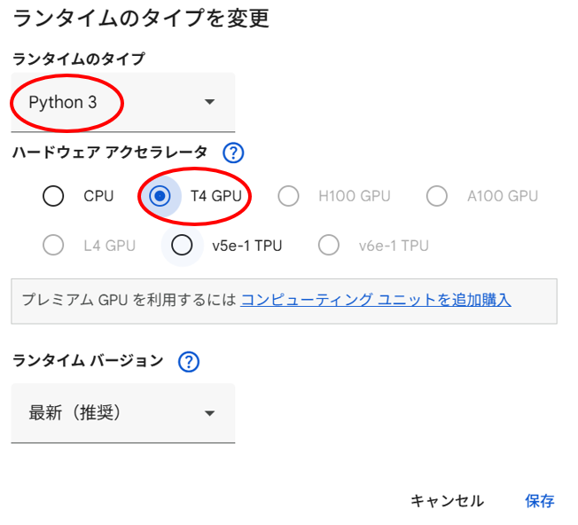
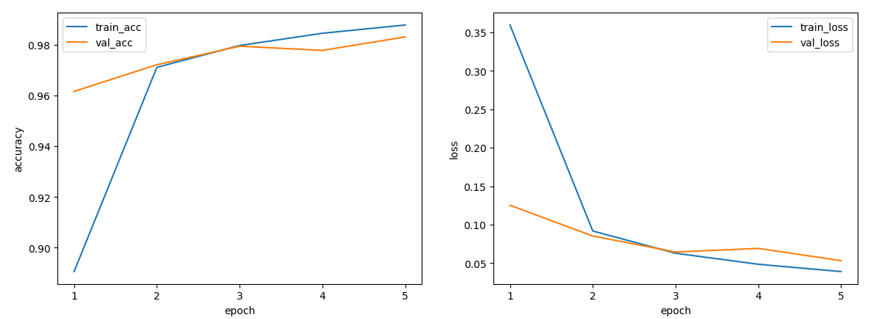
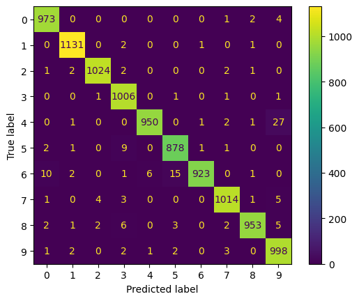
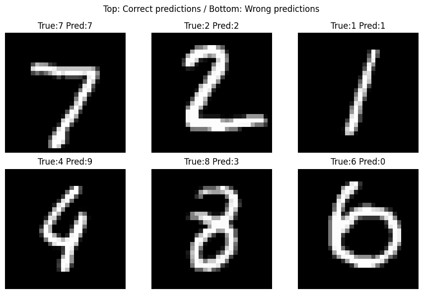

[日本語](README.md) || [English](README_EN.md)

# AdvancedVision2025
千葉工業大学大学院未来ロボティクス専攻 2025年度 アドバンスドビジョンで作成した課題．

本リポジトリでは，Python / PyTorch を用いて実装した Jupyter Notebook（`.ipynb`）形式のコードを公開しています． 
ローカル環境での動作確認はおこなっておらず，Google Colab 上での実行を前提としています．

## 概要
本モデルは28×28のグレースケール画像を入力として，10クラスの分類をおこなうCNN モデルです．

本モデルの性能評価としてMNISTデータセットを使用して5-epoch学習をした結果，精度98.6% 損失4.3%となりました.

## 特徴
- MNIST（28×28, グレースケール）対応
- 中間層：ReLU
- 出力層：Softmax
- Google Colab でそのまま実行可能

## ネットワーク構造
本モデルは2つの畳込み層とプーリング層，3つの全結合層から構成されています.
そして，28×28のグレースケール画像を入力として，中間層にReLu関数を使用し，最終層でSoftmax関数に基づく10クラス分類をおこなっています．

以下に本モデルのネットワーク構造のブロック図とアルゴリズムの数式を示します.

### ブロック図

  

### 数式
#### 入力
入力画像 $\mathbf{x}$ は 次式で表されます．

$$
\mathbf{x} \in \mathbb{R}^{1 \times 28 \times 28}
$$

#### 第1畳み込み層＋ReLU
入力画像 $\mathbf{x}$ に対して $5 \times 5$ のカーネルを用いた畳み込み演算をおこないます．
入力画像の空間サイズを保持するため，パディング（padding）を施した上で畳み込みをします．
パディングとは，入力画像の周囲に画素を追加する操作であり，本モデルではゼロパディング(囲う画素値が0)を使用し,画像の周囲を2画素分拡張します．
出力チャンネル数を 6とし， $k$ 番目のチャンネルにおける
出力特徴マップの位置 $(i, j)$ の値は次式で与えられる．

$$
z^{(1)}_k(i, j) = \sum_{u=1}^{5}\sum_{v=1}^{5} w^{(1)}_k(u, v) x(i - 1 + u, j - 1 + v) + b^{(1)}_k
$$

ここで，

* (i, j): 畳み込み後の出力特徴マップにおける画素の位置
* (u, v): 畳み込みカーネルの座標系における画素の位置
* x(i - 1 + u, j - 1 + v): 入力画像の画素値
* $w^{(1)}_k(u, v)$ : 第1畳み込み層における $k$ 番目の出力チャンネルのカーネル重み  
* $b^{(1)}_k$ : $k$ 番目の出力チャンネルに対応するバイアス 

* $z^{(1)}_k$ : $k$ 番目のチャンネルの畳み込み計算後の出力特徴マップ

* $z^{(1)}_k(i, j)$ : 出力特徴マップにおける位置 (i,j) の要素

得られた畳み込み出力 $z^{(1)}_k(i, j)$ に対して，次式に示す ReLU 関数を適用する．

$$
h^{(1)}_k(i, j) = \max\bigl(0, z^{(1)}_k(i, j)\bigr)
$$

ここで，

* $h^{(1)}_k$ :  $k$ 番目のチャンネルのReLU関数計算後の出力特徴マップ

* $h^{(1)}_k(i, j)$ : 出力特徴マップにおける位置 (i,j) の要素

#### 第1プーリング層
本モデルではプーリングの手法として次式で表されるmax poolingを使用します．
max poolingとはプーリング窓内の最大値のみを残す手法です．
具体的には，ReLU関数適用後の出力 $h^{(1)}$ の各チャンネルに対して次式を計算します．

$$
p^{(1)}_k(i, j) = \max_{n, m \in W^{(1)}(i, j)} h^{(1)}_k(n, m)
$$

ここで
* $p^{(1)}_k$ : 第1プーリング層におけるkチャンネル目のmax poolng後の出力特徴マップ

* $p^{(1)}_k(i, j)$ : 出力特徴マップ上の位置 (i,j) における要素

* $W^{(1)}(i, j)$ : 入力特徴マップ $h^{(1)}_k$ において，左上の座標 $(i \cdot s, j \cdot s)$ を起点とするプーリング窓内に含まれるインデックス $(n, m)$ の集合．

* $s$：ストライド（本モデルでは $s=2$）

#### 第2畳み込み層

第1プーリング層の出力特徴マップ $\mathbf{p^{(1)}}$ を入力として，6 チャンネルに対する $5 \times 5$ カーネルを用いた畳み込み演算をおこないます．
本層ではパディングは使用しません．
出力チャンネル数を 16 とし， $k$ 番目の出力チャンネルにおける特徴マップ上の位置 $(i, j)$ の出力値は次式で与えられます．

$$
z^{(2)}_k(i, j) = \sum_{c=1}^{6} \sum_{u=1}^{5} \sum_{v=1}^{5} w_{k,c}(u, v) p^{(1)}_c(i - 1 + u, j - 1 + v) + b^{(2)}_k
$$

ここで，

* $(i, j)$：畳み込み後の出力特徴マップにおける画素位置  
* $(u, v)$：畳み込みカーネル内の画素位置  
* $p^{(1)}_c(i - 1 + u, j - 1 + v)$：第1プーリング層の $c$ 番目チャンネルにおける入力画素値  
* $w_{k,c}(u, v)$：出力チャネル $k$，入力チャネル $c$ に対応する畳み込みカーネルの重み  
* $b^{(2)}_k$：出力チャネル $k$ に対応するバイアス  
* $z^{(2)}_k(i, j)$：第2畳み込み層における出力  

得られた畳み込み出力 $z^{(2)}_k(i, j)$ に対して，次式に示す ReLU 関数を適用する．

$$
h^{(2)}_k(i, j) = \max(0, z^{(2)}_k(i, j))
$$
* $h^{(2)}_k$ :  $k$ 番目のチャンネルのReLU関数計算後の出力特徴マップ

* $h^{(2)}_k(i, j)$ : 出力特徴マップにおける位置 (i,j) の要素

#### 第2プーリング層

本モデルでは第1プーリング層と同様に，プーリング手法として max pooling を使用します．  
第2畳み込み層の ReLU関数適用後の出力特徴マップ $h^{(2)}$ の各チャンネルに対して次式を計算します．

$$
p^{(2)}_k(i, j) = \max_{(n, m)\in W^{(2)}(i, j)} h^{(2)}_k(n, m)
$$

ここで，

* $p^{(2)}_k$：第2プーリング層における $k$ 番目チャンネルの出力特徴マップ  
* $p^{(2)}_k(i, j)$：出力特徴マップ上の位置 $(i, j)$ における要素  
* $W^{(2)}(i, j)$：入力特徴マップ $h^{(2)}_k$ において，左上の座標 $(i\cdot s, j\cdot s)$ を起点とするプーリング窓内のインデックス $(n, m)$ の集合  
* $s$：ストライド（本モデルでは $s=2$）

#### 第1全結合層＋ReLU
全結合層に入力するために，第2プーリング層の出力である特徴マップ $p^{(2)} \in \mathbb{R}^{16\times5\times5}$ の全要素を並べ替え，1次元ベクトル $\mathbf{f}$ に変換（flatten）します．このとき， $\mathbf{f}\in\mathbb{R}^{400}$ となります．

次式に示すように，この $\mathbf{f}$ を第1全結合層に入力して120次元のベクトルを出力します．

$$
\mathbf{z}^{(3)}=\mathbf{W}^{(3)}\mathbf{f} + \mathbf{b}^{(3)}
$$

* $\mathbf{W}^{(3)}\in\mathbb{R}^{120\times 400}$：第1全結合層の重み行列  
* $\mathbf{b}^{(3)}\in\mathbb{R}^{120}$：第1全結合層のバイアス  
* $\mathbf{z}^{(3)}\in\mathbb{R}^{120}$： 第1全結合層の全結合層の出力

得られた $\mathbf{z}^{(3)}$ の各成分 $i$ に対して，次式で表される ReLU 関数を適用します．

$$
h^{(3)}_i = \max(0, z^{(3)}_i)
$$

* $\mathbf{h}^{(3)}\in\mathbb{R}^{120}$： ReLU計算後の120次元のベクトル
* $h^{(3)}_i$： ReLU計算後の出力

#### 第2全結合層＋ReLU
次式に示すように，第1畳み込み層とReLU関数を経た出力 $\mathbf{h}^{(3)}$ を第2全結合層に入力して84次元のベクトルを出力します．

$$
\mathbf{z}^{(4)}=\mathbf{W}^{(4)}\mathbf{h}^{(3)} + \mathbf{b}^{(4)}
$$

* $\mathbf{W}^{(4)}\in\mathbb{R}^{120\times 84}$：第2全結合層の重み行列  
* $\mathbf{b}^{(4)}\in\mathbb{R}^{84}$：第2全結合層のバイアス  
* $\mathbf{z}^{(4)}\in\mathbb{R}^{84}$： 第2全結合層の全結合層の出力

得られた $\mathbf{z}^{(4)}$ の各成分 $i$ に対して，次式で表される ReLU 関数を適用します．

$$
h^{(4)}_i = \max(0, z^{(4)}_i)
$$

* $\mathbf{h}^{(4)}\in\mathbb{R}^{84}$： ReLU計算後の84次元のベクトル
* $h^{(4)}_i$： ReLU計算後の出力

#### 最終層(全結合層＋Softmax)
次式に示すように，第2畳み込み層とReLU関数を経た出力 $\mathbf{h}^{(4)}$ を最終全結合層に入力して10次元のベクトルを出力します．

$$
\mathbf{z}^{(5)}=\mathbf{W}^{(5)}\mathbf{h}^{(4)} + \mathbf{b}^{(5)}
$$

* $\mathbf{W}^{(5)}\in\mathbb{R}^{84\times 10}$：最終全結合層の重み行列  
* $\mathbf{b}^{(5)}\in\mathbb{R}^{10}$：最終全結合層のバイアス  
* $\mathbf{z}^{(5)}\in\mathbb{R}^{10}$： 最終全結合層の全結合層の出力

最終畳み込み層を経て出力された $\mathbf{z}^{(5)}$ はlogitsと呼ばれ，後述するモデルの学習時にSoftmax関数で確率化する前のクラスごとにおけるスコアとなっています．
また，実装では学習済みモデルで検出時にSoftmax関数を通さずlogitsのスコアが最も高いものを正解予測のクラスとしています．理由は，Softmaxを通すか否かにかかわらず選ばれるクラスは同じだからです．

最終畳み込み層で出力されたlogitisを学習時には確率に直す必要があるので，次式で示すSoftmax関数を適用する．

$$
y_i = \frac{\exp(z^{(5)}_i)}{\sum_{u=1}^{10} \exp(z^{(5)}_u)} 
$$

#### 損失関数

## 実行方法（Google Colab）

1. 以下のボタンから，Google Colab 上でノートブックを直接開くことができます．

2. ランタイムのタイプを「Python 3」に設定し, ハードウェア アクセラレータを GPU（T4 推奨）に設定してください(赤丸部分)．

  

3. ノートブック上部から順にセルを実行してください(実行にはgoogleアカウントへログイン必須)．

## 動作環境

- 実行環境：Google Colab
- GPU：NVIDIA Tesla T4
- Python：3.12.12
- PyTorch：2.9.0+cu126
- torchvision：0.24.0+cu126
- NumPy：2.0.2
- Matplotlib：3.10.0
- scikit-learn：1.6.1
- CUDA：12.6

## 性能評価
本モデルの性能評価としてMNISTデータセットを使用しました.
MNISTデータセットは手書き数字(0~9)の画像データセットで60,000枚の学習用データと10,000枚のテスト用データで構成されています.

以下は学習内容とその結果です.
### 学習
60,000枚の学習用データを訓練用画像と検証用画像で8:2に分割しました(訓練用画像48,000枚，検証用画像12,000枚).

以下は，5-epoch学習させた際の精度（accuracy）および損失（loss）の推移グラフです．

  

### 結果
以下は，上記の学習済みモデルでテスト用データに対して予測をおこなった結果です．
 
#### 精度
- テスト精度（accuracy）：98.6 %
- テスト損失（loss）：4.3 %

#### 混同行列
以下はテストデータに対する予測結果の混同行列です．
縦軸は正解ラベル，横軸はモデルによる予測ラベルです．

  

#### 認識の成功/失敗例
上段が成功例，下段が失敗例です．

  

## 参考文献
- 性能評価で使用した MNIST データセットは，Y. LeCun らによって公開されたデータセットであり，本実装では [torchvision.datasets.MNIST](https://docs.pytorch.org/vision/main/generated/torchvision.datasets.MNIST.html) を通じて取得したものを使用しました．

- CNNモデルを構成するためのPythonのコードの書き方について下記のサイトを参考にさせて頂きました.
  - [畳み込みニューラルネットワーク(CNN)をわかりやすく基本から実装まで解説](https://zero2one.jp/learningblog/cnn-for-beginners/)

- CNNモデルのネットワーク構成について下記の論文を参考にさせて頂きました.
  - [LeNet](https://direct.mit.edu/neco/article-abstract/1/4/541/5515/Backpropagation-Applied-to-Handwritten-Zip-Code)
  - [AlexNet](https://proceedings.neurips.cc/paper_files/paper/2012/file/c399862d3b9d6b76c8436e924a68c45b-Paper.pdf)
- CNNのネットワーク構成のブロック図は下記のサイトを参考にさせて頂きました.
  - [File:AlexNet_block_diagram.svg](https://commons.wikimedia.org/wiki/File:AlexNet_block_diagram.svg)

## ライセンス
* このソフトウェアパッケージは，3条項BSDライセンスの下，再頒布および使用が許可されます．

* © 2025 Yoshitaka Hirata